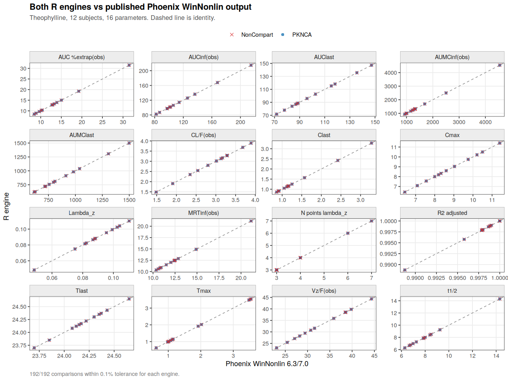
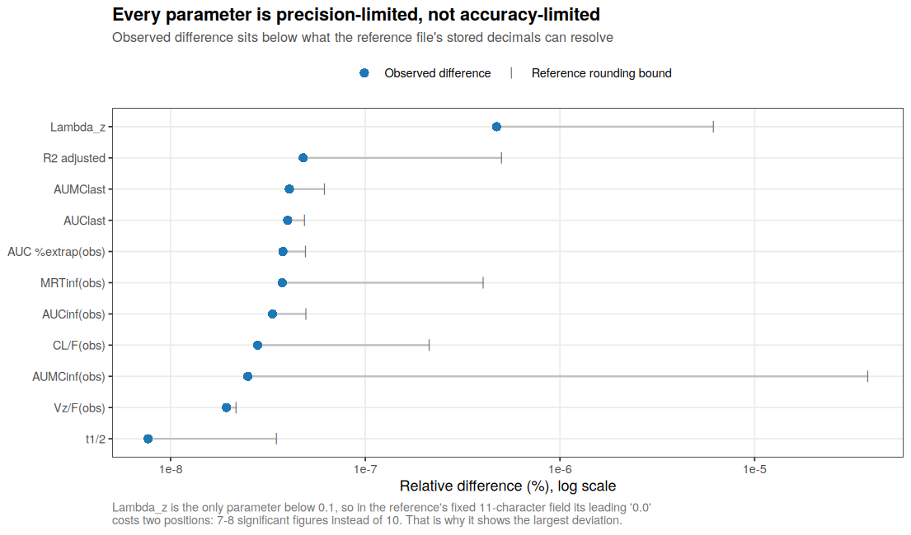
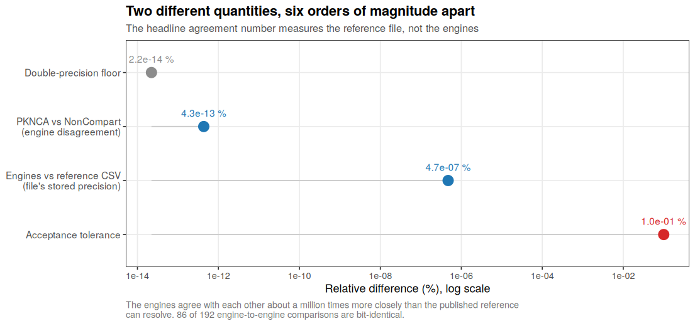
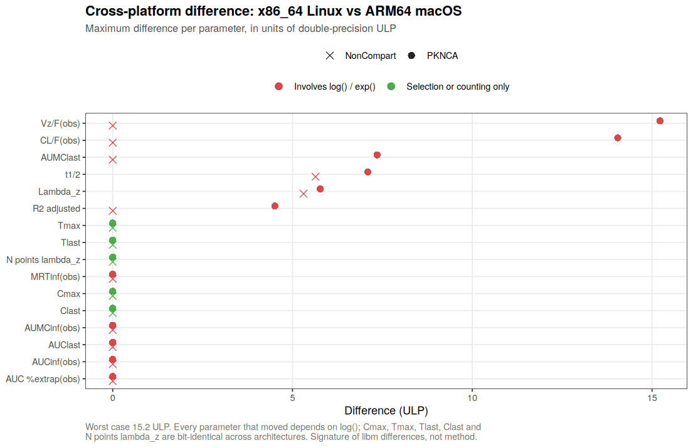

# NCA Engine Bridge: PKNCA ↔ NonCompart ↔ Phoenix WinNonlin

Cross-validation of three non-compartmental analysis engines on public
pharmacokinetic data, with a documented bridge for bringing Phoenix WinNonlin
into an R-native pipeline.

**The claim being tested:** NCA engines agree on arithmetic and disagree on
conventions. Pin the conventions and they converge; leave them unpinned and
you get 1–3% drift that nobody can explain six months later.



---

## What this does

| Track | Data | Question |
|-------|------|----------|
| **A — Validation** | `datasets::Theoph` (12 subjects, single oral dose) | Do PKNCA, NonCompart, and Phoenix WinNonlin produce the same numbers under matched settings? |
| **B — Regulatory shape** | CDISC pilot study PC/EX domains via `{pharmaversesdtm}` | Can the same pipeline go SDTM → NCA → CDISC PP-style output? |

Track A runs with no commercial license. It compares against a **published
Phoenix WinNonlin 6.3/7.0 output** for the same dataset, fetched at runtime.
Track B needs only CRAN packages.

If you own Phoenix, `phoenix/PHOENIX_SETUP.md` walks through reproducing the
analysis in the GUI and dropping the export into the comparison.

---

## Why three engines

**PKNCA** is the modern R-native NCA library — configurable, well-tested,
integrates cleanly with a `{tidyverse}` / `{nlmixr2}` pipeline.

**NonCompart** is written specifically to reproduce WinNonlin's conventions:
its lambda-z selection criterion, its AUC integration methods, its CDISC PP
parameter names. Its published validation package reports agreement with
WinNonlin 6.3 and 7.0 to within 0.1%.

**Phoenix WinNonlin** is the commercial incumbent and what most regulatory
reviewers have seen.

That triangle is useful. NonCompart is the bridge term: when PKNCA and Phoenix
disagree, NonCompart tells you whether the cause is a convention difference
(NonCompart will side with Phoenix) or something else.

---

## Quick start

```bash
git clone https://github.com/tjmb03/pknca-winnonlin-bridge
cd pknca-winnonlin-bridge

Rscript -e 'install.packages(c("PKNCA","NonCompart","ggplot2","testthat"))'
Rscript run_all.R
```

Add the CDISC track:

```bash
Rscript -e 'install.packages("pharmaversesdtm")'
Rscript run_all.R --cdisc
```

Outputs in `outputs/`:

```
comparison_per_subject.csv   every subject × parameter × engine, with % diff
comparison_summary.csv       agreement by parameter
agreement_*.png              identity-line scatter, faceted by parameter
pp_domain.csv                CDISC PP-style output (--cdisc)
provenance.txt               R version, package versions, rules in force
```

---

## The settings contract

Every engine reads its configuration from one place — `R/00_config.R`. This is
the design decision that makes the comparison mean anything.

```r
NCA_RULES <- list(
  auc_method        = "lin up/log down",  # PKNCA vocabulary
  noncompart_down   = "Log",              # NonCompart vocabulary, same rule
  min_hl_points     = 3L,
  allow_tmax_in_hl  = FALSE,
  adj_r2_factor     = 0.0001,
  max_aucinf_pext   = 20,
  tolerance         = 0.001                # 0.1%
)
```

`assert_rules_consistent()` runs before anything else and fails loudly if
`auc_method` and `noncompart_down` have drifted apart. The two words mean the
same thing in different dialects, and a silent mismatch there produces exactly
the kind of small unexplained AUC difference this repo exists to eliminate.

The Phoenix GUI equivalents are tabulated in `phoenix/PHOENIX_SETUP.md`.

---

## Parameter crosswalk

The three engines name the same quantities differently. CDISC `PPTESTCD` terms
are the canonical key:

| PPTESTCD | PKNCA | NonCompart | WinNonlin |
|----------|-------|------------|-----------|
| `CMAX` | `cmax` | `CMAX` | `Cmax` |
| `AUCLST` | `auclast` | `AUCLST` | `AUClast` |
| `AUCIFO` | `aucinf.obs` | `AUCIFO` | `AUCINF_obs` |
| `LAMZHL` | `half.life` | `LAMZHL` | `HL_Lambda_z` |
| `CLFO` | `cl.obs` | `CLFO` | `Cl_F_obs` |
| `VZFO` | `vz.obs` | `VZFO` | `Vz_F_obs` |

Full map in `PARAM_MAP` (`R/00_config.R`), 16 parameters.

---

## On automating Phoenix

Worth stating plainly, because it shapes the architecture:

**Phoenix's documented command-line mode drives the NLME engine, not the NCA
object.** There is no supported `Phoenix.exe --run-nca` switch. Scripted NCA in
Phoenix goes through the separately-licensed **AutoPilot Toolkit**, an **R Script
object inside a Phoenix workflow** (Phoenix orchestrates, R executes), or
enterprise **PKS / WebServices**.

Certara's open R suite (`Certara.RsNLME` and friends) covers NLME modelling and
does not include an NCA package.

So the practical bridge for an R-driven pipeline is **export / import**:

```
R writes Phoenix-ready CSV  →  Phoenix GUI (documented settings)  →
CSV export  →  R ingests and compares
```

Slower than a subprocess call, but it works on a plain WinNonlin license,
produces a checked-in artifact, and keeps the audit trail intact. If your site
has AutoPilot, the same settings automate directly.

---

## Verified results

Executed end-to-end on R 4.3.3 / PKNCA 0.12.1 / NonCompart 0.8.2.

**Track A — Theophylline, against published Phoenix WinNonlin 6.3/7.0 output:**

```
PKNCA vs WinNonlin
  coverage : 192/192 comparisons made
  agreement: 192/192 within tolerance
NonCompart vs WinNonlin
  coverage : 192/192 comparisons made
  agreement: 192/192 within tolerance

VERDICT: CLEAN -- full coverage, all within tolerance.
```

**Two different quantities, often conflated. Both are reported here.**

*Agreement with the published reference* — maximum across all 192 comparisons,
either engine: **4.7 × 10⁻⁷ %**.

This number is a property of the *reference file*, not of the engines. The
published CSV stores `Lambda_z` to 9 decimal places (`0.099287021`), while the
engines carry `0.0992870205306`. Half-ulp at 9 dp divided by λz ≈ 0.0993 gives
a predicted bound of 5.04 × 10⁻⁷ %; the observed maximum is 4.73 × 10⁻⁷ %.
Fully accounted for, nothing left to explain.

Every one of the eight largest differences is `Lambda_z`, and the mechanism is
in the file format. The reference is written to a **fixed field width of 11
characters** (280 of 311 numeric cells are exactly 11 wide). For most
parameters that yields 10 significant figures. λz is the only quantity in the
table below 0.1, so its leading `0.0` consumes two positions and it lands at
**7–8 significant figures instead of 10**:

| Parameter | Median magnitude | Min significant figures |
|-----------|-----------------|------------------------|
| `Lambda_z` | 0.0881 | **7** |
| `Cl_F_obs` | 3.07 | 9 |
| `HL_Lambda_z` | 7.87 | 10 |
| `AUClast` | 92.3 | 10 |
| `Vz_F_obs` | 31.1 | 10 |

Two or three fewer significant figures is a 100–1000× larger relative rounding
error, which is exactly the gap between λz and everything else in the observed
differences. This is a property of how the file was written. It is not λz being
estimated less accurately.



Every parameter sits below its own rounding bound — the comparison is
**precision-limited, not accuracy-limited**. `attribute_precision()` recomputes
this on every run and writes `outputs/precision_attribution.csv`.

*Agreement between the engines* — PKNCA vs NonCompart directly, with no
reference file involved: **4.3 × 10⁻¹³ %**, with **86 of 192 comparisons
bit-identical**. The remainder differ only in floating-point summation order on
AUMC. For scale, double precision itself bottoms out at 2.2 × 10⁻¹⁴ %.



So the engines agree with each other roughly a **million times more closely**
than the reference file's stored precision can resolve. The correct statement
is that both R engines reproduce the published WinNonlin values *to the full
precision at which those values were published* — which is the strongest claim
the reference data can support. Reproducing them "exactly" is not something a
rounded CSV can demonstrate either way.

**Track B — CDISC pilot (xanomeline), 254 subjects:** 4,064 PP-style records.
Terminal-phase fit obtained for 168/254 subjects (66%); AUCinf, CL/F, Vz/F and
MRT are `NA` for the remainder and the pipeline says so rather than emitting a
quietly incomplete dataset.

**Tests:** 17 test blocks / 103 expectations, 0 failures, 0 warnings, 0 skips.

**Cross-platform:** verified independently on two machines — see below.

### Independent verification

`verify_independent.py` reimplements NCA from first principles in pure Python —
linear-up/log-down trapezoid, WinNonlin Best-Fit lambda-z selection, AUMC,
MRT — with no R and no NCA library. It exists so that "the engines agree" is
corroborated by something structurally unrelated to either engine.

Result: **216/216 comparisons** (18 parameters x 12 subjects) agree with the
WinNonlin reference to its published precision — maximum deviation 4.7e-7%,
again set by the reference's 9-decimal-place storage of `Lambda_z` rather than
by any disagreement in the calculation.

The lambda-z *window selection* matched exactly — number of points, first
timepoint, last timepoint, all zero difference — including the non-obvious
cases (subject 6 selecting 7 points from t=2.03 h; subject 8 selecting 6 from
t=3.53 h). That is a structural match, not just arithmetic agreement.

```bash
python3 verify_independent.py
```

Worth noting: on its first run this script disagreed with WinNonlin on AUMC by
78% while matching AUC to 1e-8. The localisation was immediate — a missing
dt/dt^2 factor in the log-trapezoidal AUMC term. A verifier that never
disagrees with anything is not verifying.

### Sensitivity of the harness

A green verdict is only meaningful if the harness can go red. Four mutations:

| Mutation | Result |
|----------|--------|
| Flip AUC method to linear (reference follows) | CLEAN — correct; agreement holds under *both* conventions, and the two WinNonlin references genuinely differ (147.23 vs 148.92 for subject 1) |
| Engines linear, reference log (true mismatch) | **96/192 fail**, differences 3.6–4.3% |
| Perturb one concentration by 1% | **1/12 subjects fail** on AUClast, 0.1098% |
| Reinstate the BLQ bug | **NOT CLEAN**, 72 comparisons missing |

The single-point perturbation is the informative one: changing one of 132
concentration values by 1% moves AUClast by 0.11% and is caught. That is the
resolution limit.

---

## Cross-platform reproducibility

The same pipeline, run independently on two machines differing in operating
system, CPU architecture, R version, and three dependency versions.

| | Run A | Run B |
|---|---|---|
| Platform | `x86_64-pc-linux-gnu` | `aarch64-apple-darwin20` |
| OS | Ubuntu 24.04 | macOS (Apple Silicon) |
| R | 4.3.3 (2024-02-29) | 4.5.2 (2025-10-31) |
| PKNCA | 0.12.1 | 0.12.1 |
| NonCompart | 0.8.2 | 0.8.2 |
| dplyr | 1.1.4 | 1.2.0 |
| tidyr | 1.3.1 | 1.3.2 |
| ggplot2 | 3.4.4 | **4.0.2** (major version change) |

The NCA engines are pinned; everything around them moved. Raw outputs from both
runs are committed under `reproducibility/`.

**Identical verdicts.** Both runs, both engines: 192/192 coverage, 192/192
within tolerance, 16/16 precision-limited, `VERDICT: CLEAN`. The coverage and
pass/fail data frames are `identical()` across platforms, and the headline
number matches to five significant figures on both:

```
worst |difference| vs reference:  4.7275e-07 %   (both engines, both platforms)
```

**Numerical agreement between platforms:**

| Column | Bit-identical | Max relative difference |
|--------|--------------|------------------------|
| `WinNonlin` | 192/192 | 0 (control — same downloaded file) |
| `NonCompart` | 190/192 | 1.25e-15 |
| `PKNCA` | 182/192 | 3.38e-15 |

Worst cross-platform difference is **3.38e-15 relative, about 15 ULP** of double
precision. Twelve of 384 cells differ, and they are not randomly distributed:



Every parameter that moved depends on `log()` — the terminal log-linear
regression (`Lambda_z`, `t1/2`, `R2 adjusted`), quantities derived from it
(`CL/F`, `Vz/F`), and the log-trapezoidal `AUMClast`. Parameters computed
without transcendental functions (`Cmax`, `Tmax`, `Tlast`, `Clast`,
`N points lambda_z`) are **bit-identical across architectures**. That is the
signature of different `libm` implementations for `log`/`exp` on ARM64 versus
x86_64, not a difference in method.

### Two details worth noting

**Five parameters differ from WinNonlin by exactly zero** on both platforms:
`Cmax`, `Tmax`, `Tlast`, `Clast`, `N points lambda_z`. These are selected
observations and an integer count rather than computed quantities, so there is
nothing for rounding to act on. A non-zero difference in any of them would
indicate a subject-alignment error, which makes them a free canary for the
factor-coercion bug described below.

**Several parameters sit just under their rounding bound**, which is the
expected signature of a precision-limited comparison:

| Parameter | Observed / bound |
|-----------|-----------------|
| `Vz/F(obs)` | 0.89 |
| `AUClast` | 0.82 |
| `AUC %extrap(obs)` | 0.77 |
| `AUCinf(obs)` | 0.67 |
| `AUMClast` | 0.66 |

If engine error dominated, observed would exceed the bound and the comparison
would fail. If the reference happened to round favourably, observed would sit
far below it. Ratios in the 0.7–0.9 range across independent parameters are what
you get when the difference *is* the rounding.

### What this establishes, and what it does not

**Establishes:** the harness and both engines are portable. Results do not
depend on OS, CPU architecture, R version, or the surrounding tidyverse stack —
including a ggplot2 major version bump that left the figures unchanged.

**Does not establish:** version stability of the engines themselves. PKNCA
0.12.1 and NonCompart 0.8.2 were used on both machines. Whether a future PKNCA
release still reproduces these numbers is a separate question, and the right way
to answer it is to re-run this pipeline after upgrading.

---

## Three bugs this suite caught

Recorded because they are the interesting part, and all three are now
regression-tested.

**1. `PKNCA.options()` mutates global state.** Called with arguments it *sets*
options globally and returns the complete 17-entry option set, including
`NULL`-valued entries that fail PKNCA's own re-validation when passed back to
`PKNCAdata()`. Options must be a plain list of overrides. A validation harness
that leaks global state between engine runs is not a validation harness.

**2. A BLQ rule silently deleted real measurements.** PKNCA classifies any
concentration of exactly `0` as BLQ. Nine of twelve Theophylline subjects have
a genuine pre-dose zero. With `blq_first = "drop"` those records vanished, the
interval start (0) then preceded the first surviving measurement (0.25 h), and
**every AUC-derived parameter came back `NA` for those nine subjects**. Cmax and
half-life were unaffected — so the parameters the tests happened to assert all
passed.

**3. The harness counted `NA` as agreement.** This is the one that matters.
Combined with bug 2, the comparison reported:

```
PKNCA vs WinNonlin: 120/120 within tolerance
  All parameters agree.
```

A green verdict, on a run where 72 of 192 comparisons never happened. The fix
tracks coverage separately from agreement and refuses to print CLEAN when any
comparison is missing. Same data, after the fix:

```
  coverage : 120/192 comparisons made  (72 MISSING)
  NOT COMPARED (engine returned no value):
    AUCLST     AUClast              9/12 subjects
    AUCIFO     AUCinf(obs)          9/12 subjects
    ...
VERDICT: NOT CLEAN
```

Reporting success by not testing is the worst failure mode available to
software like this, and it is invisible from the summary line.

---

## Publishing this repository

The repository is initialised with one commit. Set your identity, re-author it,
and push:

```bash
git config user.name  "Your Name"
git config user.email "you@example.com"
git commit --amend --reset-author --no-edit

./push_to_github.sh <your-github-username>
```

`push_to_github.sh` refuses to run if the git identity is still the placeholder,
the working tree is dirty, a credential pattern appears in tracked files, any
file exceeds 50 MB, or the test suite fails. It will not force-push over an
existing remote branch.

Create the empty GitHub repository first (no README, licence or .gitignore —
those exist here already), or use `gh repo create`.

Running `run_all.R` does not dirty the tree: `outputs/` is gitignored and the
committed figures are only rebuilt when missing or when passed `--figures`.

---

## Repository layout

```
R/
  00_config.R              settings contract, paths, parameter crosswalk
  01_prepare_theoph.R      Theophylline prep + input validation
  02_engine_pknca.R        PKNCA wrapper → tidy PPTESTCD output
  03_engine_noncompart.R   NonCompart wrapper + AUC-method crosswalk
  04_engine_winnonlin.R    reference fetch, Phoenix export/import
  05_compare.R             pairwise comparison, tolerance test, plots
  06_cdisc_track.R         SDTM PC/EX → NCA → PP domain
phoenix/
  PHOENIX_SETUP.md         GUI settings mapped to NCA_RULES
  input/                   generated Phoenix-ready CSV
  reference/               WinNonlin outputs (fetched or yours)
tests/testthat/            17 tests / 94 expectations: config, prep, crosswalk,
                           engines, plus regressions for the three bugs above
  07_figures.R             regenerates the figures embedded in this README
figures/                   committed PNGs used above
reproducibility/           raw outputs from both platform runs
  08_strip_reference.R     optional: drop reference-derived values from records
push_to_github.sh          pre-flight checks, then push
verify_independent.py      from-scratch NCA in pure Python; no R involved
run_all.R                  pipeline entry point
```

---

## Tests

```bash
Rscript -e 'testthat::test_dir("tests/testthat")'
```

Engine tests skip cleanly if `PKNCA` or `NonCompart` is absent, so the config
and data-preparation tests always run.

Verified on Ubuntu 24.04, R 4.3.3, PKNCA 0.12.1, NonCompart 0.8.2:
`[ FAIL 0 | WARN 0 | SKIP 0 | PASS 94 ]`
(94 = expectations; 17 `test_that` blocks, several looping over all 12 subjects)

One test worth calling out:

```r
test_that("Subject is coerced through character, not factor level", {
  # Theoph's Subject factor is ordered by peak concentration, so the level
  # index and the printed label differ. as.numeric(factor) silently returns
  # the wrong subject and every downstream comparison misaligns.
  expect_equal(max(s1$conc), 10.50)
})
```

That bug is easy to write, produces plausible-looking output, and would
invalidate the entire comparison. It gets a test.

---

## Known convention differences

Where engines legitimately diverge, and what to check:

| Symptom | Likely cause |
|---------|--------------|
| AUC differs ~1–3% | Linear vs linear-up/log-down integration |
| Half-life differs on some subjects | Lambda-z point selection; whether Cmax is eligible |
| CL differs uniformly | AUClast vs AUCinf in the denominator |
| Vz differs, CL agrees | `vz.obs` vs `vz.pred` — observed vs regression-predicted Clast |
| Everything differs by a constant factor | Dose convention (flat vs subject-specific) |
| Subject-level chaos | Factor-to-numeric coercion (see above) |
| AUC parameters all `NA` for some subjects | `blq_first = "drop"` deleting genuine zeros at time 0 |

---

## Data provenance and licensing

- **Theophylline** — `datasets::Theoph`, ships with R
- **CDISC pilot PC/EX** — `{pharmaversesdtm}` (Apache 2.0); the CDISC
  SDTM/ADaM Pilot Project data is publicly released
- **WinNonlin reference output** — published as part of the NonCompart
  validation package by Sungpil Han. **Fetched at runtime and gitignored, not
  vendored.** As of checking, that repository carries no `LICENSE` file, so
  redistribution terms are undeclared; fetching avoids redistributing the file
  itself.

  One caveat, stated plainly: the platform records under `reproducibility/`
  contain a `WinNonlin` column holding 192 of those reference values, so a
  small factual excerpt is committed here. These are numeric NCA parameters
  computed from a public dataset (`datasets::Theoph`), reproduced for scholarly
  validation and cited below. If you would prefer not to include them, run
  `Rscript R/08_strip_reference.R` to rebuild the records without that column;
  only figure 3 depends on it and it degrades gracefully. Nothing here is legal
  advice — if it matters for your use, the reliable move is to ask the author
  for an explicit licence.

Reference for the WinNonlin comparison:

> Kim H, Han S, Cho YS, Yoon SK, Bae KS. Development of R packages
> 'NonCompart' and 'ncar' for noncompartmental analysis (NCA).
> *Transl Clin Pharmacol.* 2018;26(1):10–15.

The published validation compared **NonCompart 0.4.4** against WinNonlin 6.3
and 7.0 in 2018. This repository demonstrates the same agreement using
**NonCompart 0.8.2** (2026) and **PKNCA 0.12.1** — eight years and many
releases later, and for PKNCA an engine the original validation never covered.

**What is and is not established here:** the reference CSVs are taken on trust
from that published validation. Phoenix was not run in producing this
repository. The claim demonstrated is that PKNCA, NonCompart, and an
independent from-scratch implementation all reproduce those published WinNonlin
numbers exactly. Confirming that a current Phoenix 8.x installation still
produces the same values requires running it yourself — which is what
`phoenix/PHOENIX_SETUP.md` is for.

Phoenix, WinNonlin, and AutoPilot Toolkit are trademarks of Certara USA, Inc.
This repository is not affiliated with or endorsed by Certara.

---

## License

MIT — see `LICENSE`.
